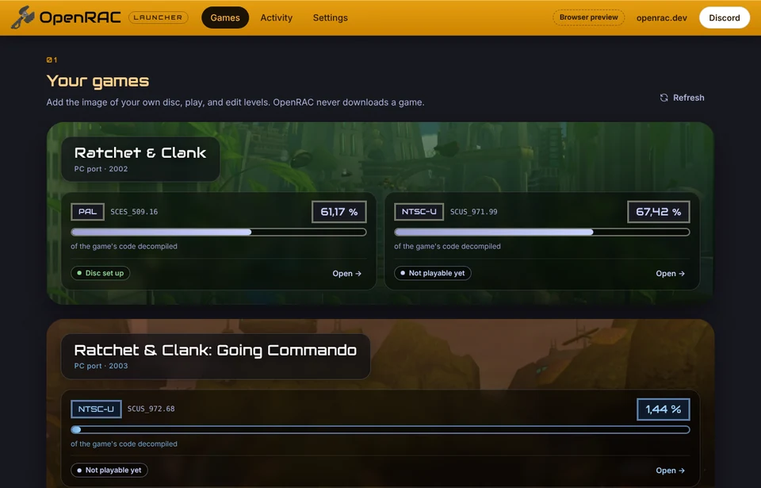
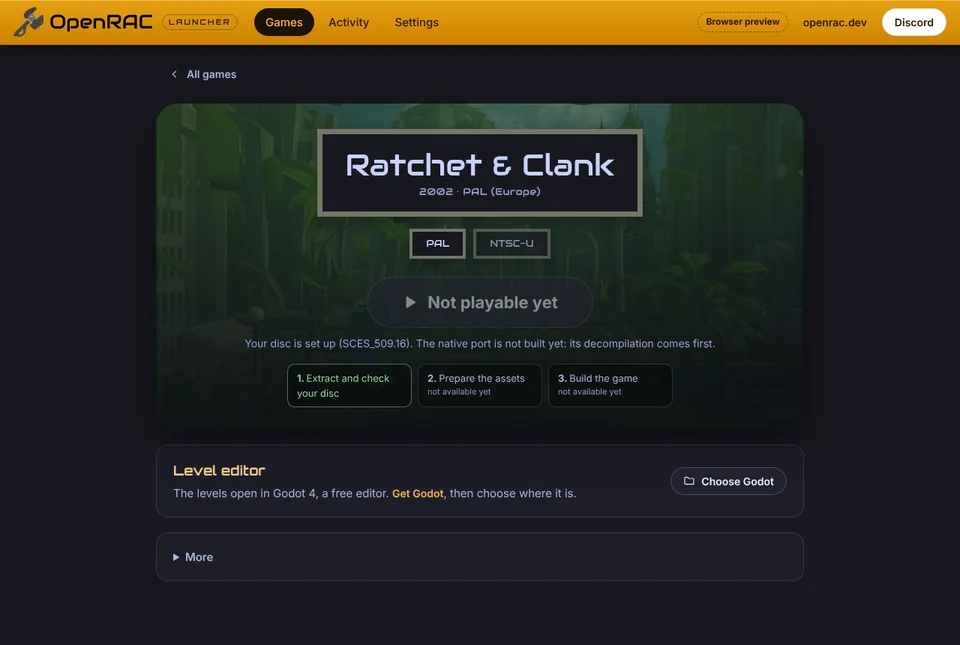

# OpenRAC Launcher

A desktop app for the Ratchet & Clank games through OpenRAC, for all four
games. It is to OpenRAC what [OpenGOAL's launcher](https://github.com/open-goal/launcher)
is to Jak and Daxter: a player sets a game up from the image of their own
disc, plays the **native PC port**, and can open the levels in Godot to edit
them. **There is no emulation**: the launcher never runs the retail program
or a model of the console ([docs/port](../docs/port/README.md)).

The native ports do not exist yet, so today a player can set a game up from
their disc and edit levels, and Play says the port is not built yet. With
**developer tools** switched on in Settings, the launcher is also a
contributor's console: place what each decompilation's build needs, set up
the toolchains, build, check, and see each decompilation's progress. Either
way it runs the same commands a contributor types, from the user's own
OpenRAC checkout, and shows their output live.

It is a [Tauri 2](https://tauri.app/) app: a Rust side (`core/` and
`src-tauri/`) that does every file and process operation, and a Svelte 5 UI
(`src/`) styled after [openrac.dev](https://openrac.dev).

| Games                                                                                          | A game                                                                                          |
| ---------------------------------------------------------------------------------------------- | ----------------------------------------------------------------------------------------------- |
|  |  |

## Read first

| You want to                                                    | Read                                         |
| -------------------------------------------------------------- | -------------------------------------------- |
| Connect a game's set-up, build, checks or play to the launcher | [docs/INTEGRATION.md](docs/INTEGRATION.md)   |
| Understand how the parts fit, add a command or a page          | [docs/ARCHITECTURE.md](docs/ARCHITECTURE.md) |
| Change the look, add a game's colours                          | [docs/STYLE.md](docs/STYLE.md)               |
| Know where the native port stands                              | [docs/port](../docs/port/README.md)          |

OpenRAC's own rules apply here too ([AGENTS.md](../AGENTS.md),
[CONTRIBUTING.md](../CONTRIBUTING.md), [SOURCING.md](../docs/policy/SOURCING.md)):
the launcher never downloads, uploads or bundles a game.

## Setting a game up from your disc

OpenGOAL's flow, step for step ([docs/INTEGRATION.md](docs/INTEGRATION.md#setting-a-game-up)):

1. **Set up from your disc** asks for the image (`.iso`) of the player's own
   disc.
2. The launcher runs OpenRAC's extractor ([tools/extractor.py](../tools/extractor.py))
   as a job: it copies the disc's files into the install folder and checks
   the boot executable against the builds OpenRAC knows
   (`games/<game>/game.json`). An unknown or damaged image is refused, with
   OpenGOAL's error number for the same failure.
3. Preparing the assets and building the game are the next steps; they show
   as "not available yet" until the port exists.

**Remove the set-up** deletes what set-up made, as OpenGOAL's uninstall does;
the disc image and saves are kept.

## Develop

You need Node 20+ and Rust (stable). For the desktop app on Linux, Tauri's
system libraries too (Debian and Ubuntu:
`libwebkit2gtk-4.1-dev libgtk-3-dev librsvg2-dev libsoup-3.0-dev`; see
[Tauri's prerequisites](https://tauri.app/start/prerequisites/) for the others).

```sh
cd launcher
npm ci
npm run dev           # the UI in a browser at http://localhost:1430, with mock data (no Rust needed)
npm run tauri dev     # the desktop app, with the real Rust side
npm run tauri build   # an installer for this platform, in target/release/bundle/
```

The browser preview (`npm run dev`) reads the real `games/*/game.json`,
`progress/summary.json` and `actions.json`, and makes up the rest (which
games are set up, what a job prints): see `src/lib/mock.ts`. Add `?setup` to
the address for the first-run screen, `?version=rac1/pal` for a game page,
`?page=tasks` for Tasks.

## Check

```sh
npm run verify                                         # svelte-check, ESLint, Prettier, Vitest
cargo test -p openrac-launcher-core                    # the Rust logic; no WebKit needed
cargo clippy --workspace --all-targets -- -D warnings  # needs Tauri's system libraries
cargo fmt --all --check
python3 -m unittest discover -s ../tools               # includes the extractor's tests
```

`cargo test -p openrac-launcher-core` also checks `actions.json` against the
checkout: every version key exists in a game.json, no duplicate ids, only known
placeholders, every `docs` path exists. CI runs all of these
(`.github/workflows/checks.yml`, the `launcher` job).

## Layout

```
launcher/
├── actions.json        what the launcher can run, per version: the file to edit to connect a game
├── core/               Rust, no window: games, actions, status, set-up, settings, detection, jobs,
│                       Discord presence (+ tests)
├── src-tauri/          the desktop app: Tauri commands over core/, window and bundle config, icons
├── src/                the UI: Svelte 5 + TypeScript
│   ├── lib/            api.ts (commands and types), mock.ts (browser preview), app state, queue, themes
│   ├── components/     header, game card, action card, progress bar, path field, toasts, icons
│   └── pages/          Library, Game (player and developer views), Tasks, Settings (also the first run)
├── public/             the wrench logo and favicon (from openrac-site), game backdrops and previews (img/)
└── docs/               ARCHITECTURE, INTEGRATION, STYLE
```

## What it writes, and what it connects to

- **Its settings**: `launcher.json` in the per-user config folder
  (`~/.config/dev.openrac.launcher/` on Linux,
  `~/Library/Application Support/dev.openrac.launcher/` on macOS,
  `%APPDATA%\dev.openrac.launcher\` on Windows). Settings shows the path.
- **Games set up from discs**: the install folder (Settings; by default the
  launcher's per-user data folder), `active/<game>/data/`, as OpenGOAL lays
  it out.
- **Through the tools it runs**: whatever those tools write in the checkout
  (`baserom/` inputs, build output, `assets/godot` for the level editor), all
  ignored by git.
- **Progress from openrac.dev**: at start-up it fetches
  `https://openrac.dev/progress.json` and, when that works, rewrites the
  checkout's `progress/summary.json` with it (the copy shown offline).
- **Discord**: unless switched off in Settings, it shows the game being
  viewed in Discord's Rich Presence through Discord's local socket (Linux and
  macOS), under OpenRAC's Discord application.
- **Linux desktop integration**: at every start it writes its icons to
  `~/.local/share/icons/hicolor/` and two `.desktop` files to
  `~/.local/share/applications/`, and refreshes the desktop's caches.

## License and credits

The launcher is under the GNU GPL v3 or later, as the rest of OpenRAC's top
level ([LICENSE.md](../LICENSE.md), [COPYING](../COPYING)). It takes its
look, logo and favicon from the OpenRAC website (MIT) and bundles three fonts
(SIL Open Font License); see [THIRD_PARTY_NOTICES.md](THIRD_PARTY_NOTICES.md).
Its design follows the T3SDK launcher for Thief: Deadly Shadows (MIT), and two
small helpers are adapted from it; its disc set-up follows OpenGOAL's launcher
and extractor (ISC), from their documented behaviour, with no code taken.
